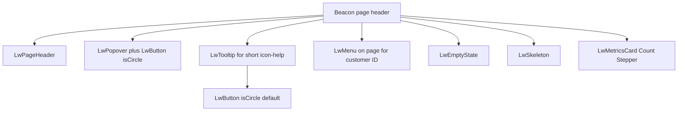

# Example plan — Beacon header → kit roots

Saved working plan (executed from this copy). Companion to
[examples.md](../examples.md), [perspective.md](../perspective.md), and
[SKILL.md](../SKILL.md).

## What we learned

Beacon’s page header mixes **kit chrome** with **product-named shells** and
**raw PF**. The red flags are not “missing Beacon components”; they are **kit
roots used incorrectly or not at all**.

**Rules:**

- Lightwell surfaces compose **kit roots** (`LwButton`, `LwMenu`, `LwPopover`,
  `LwTooltip`, `LwEmptyState`, `LwSkeleton`, …).
- Domain may own **fetch + copy + item builders** — not a second chrome API
  named after the first consumer (`SlaInfoPopover`, inventing `lightwell-help-btn`).
- **Replace usages**, not “promote the domain wrapper into kit.” Leave dead
  domain files **untouched** until a [dissolution sweep](dissolution-map.md).
  Migrate PRs are kit + pages only; dissolve PRs show pure removal.
- Icon-help interaction is centralized: **`LwTooltip` defaults its trigger to
  `LwButton` + PF `isCircle`**. Views vary content; they do not reinvent the
  circle-help control.
- Richer anchored content stays **`LwPopover` + `LwButton isCircle`** composed
  at the call site (Beacon owns SLA copy).
- **Root-only kit hosts** for EmptyState / Skeleton: harness the PF root;
  Footer/Actions/Body stay call-site composition (extend only when ≥2 surfaces
  need a real kit job).

## Core component map

| Beacon today | Kit root | Call-site owns |
| --- | --- | --- |
| Raw `Button` + `lightwell-help-btn` in `SlaInfoPopover` | `LwButton` — PF `isCircle` passthrough (no twin prop) | icon, `aria-label`, handlers |
| `SlaInfoPopover` usage | Compose `LwPopover` + `LwButton isCircle` at Beacon | header/body copy |
| New consistent icon-help | `LwTooltip` — PF `Tooltip` host; default trigger = circle plain `LwButton` | `content`, icon, labels |
| `CustomerIdSelect` usage | `LwMenu` + `LwSkeleton` composed on Beacon (fetch on page) | items, fieldLabel, toggleProps |
| Raw `EmptyState` in header | `LwEmptyState` — root only, full PF passthrough | Footer/Actions/Body children |
| Raw `Skeleton` | `LwSkeleton` — root only, full PF passthrough | height/width/etc. |

## Implementation checklist

1. **LwButton owns circle** — document/use PF `isCircle`; test `pf-m-circle`; drop `lightwell-help-btn` from replaced usage.
2. **`LwTooltip` primitive** — `primitives/tooltip/`; default trigger = `LwButton isCircle variant="plain"`; swap `LwMetricsCount` raw Tooltip if cheap.
3. **Replace `SlaInfoPopover` usages** — Beacon `hasAction` composes `LwPopover` + `LwButton isCircle`; leave domain file untouched ([dissolution-map](dissolution-map.md)).
4. **Customer ID** — page composes `LwMenu` / `LwSkeleton` + fetch; do not rewrite `CustomerIdSelect.tsx` in the migrate PR.
5. **`LwEmptyState` / `LwSkeleton`** — root harnesses only; swap Beacon header call sites.
6. **Skill enrichment** — kit roots in chrome; refuse product-named shells; circle-help pattern; root-only EmptyState/Skeleton; replace usages first; maintain dissolution map.

## Validate

- Unit tests: circle button, LwTooltip default trigger, EmptyState/Skeleton passthrough, customer `LwMenu` on Beacon.
- Beacon header: browser status stated honestly in closeout.
- Dissolution inventory lists leftovers **without** editing those domain files.
